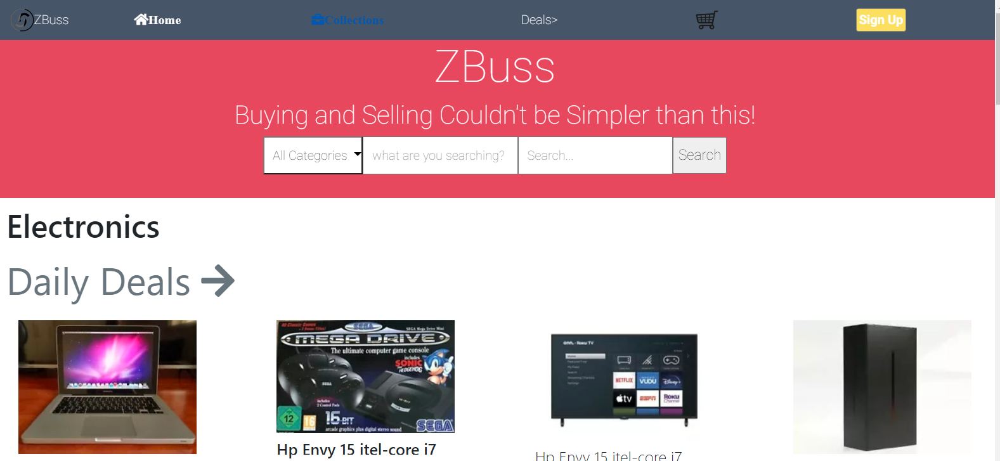

# Capstone-HTML-CSS

## Hello there

> This is my first capstone project for html/css.

## Screenshot

Screenshot: 

## Description

This project is a replica of with few changes [ZATTIX](https://www.behance.net/gallery/24796463/ZATTIX).

It is a static version. All contents (texts, images, icons and fonts) have been retrieved from the **ZATTIX** website itself.

## Built With

- HTML
- CSS
- Linter
- VScode
- Bootstrap

## Demo Link

[Live Demo Link]( https://elisha2kyakpo1.github.io/Capstone-HTML-CSS/)

## Watch Video

[Project Video](https://www.loom.com/share/399fb93759d1478f8dc2d17ba1a97008)

## Contributing

Contributions, issues and feature requests are welcome! Start by:

- Forking the project
- Cloning the project to your local machine
- cd into the project directory
- Run git checkout -b your-branch-name
- Make your contributions
- Push your branch up to your forked repository
- Open a Pull Request with a detailed description to the development branch of the original project for a review

## Authors

👤 Elisha Kyakopo
Github: [@elisha2kyakopo1](https://github.com/elisha2kyakopo1)

Twitter: [@elisha](https://twitter.com/elisha1k)

Linkedin: [Elisha kyakopo](https://www.linkedin.com/in/elisha-kyakopo-009aa3197/)

## Show your Support

Give a ⭐ if you like this project!
